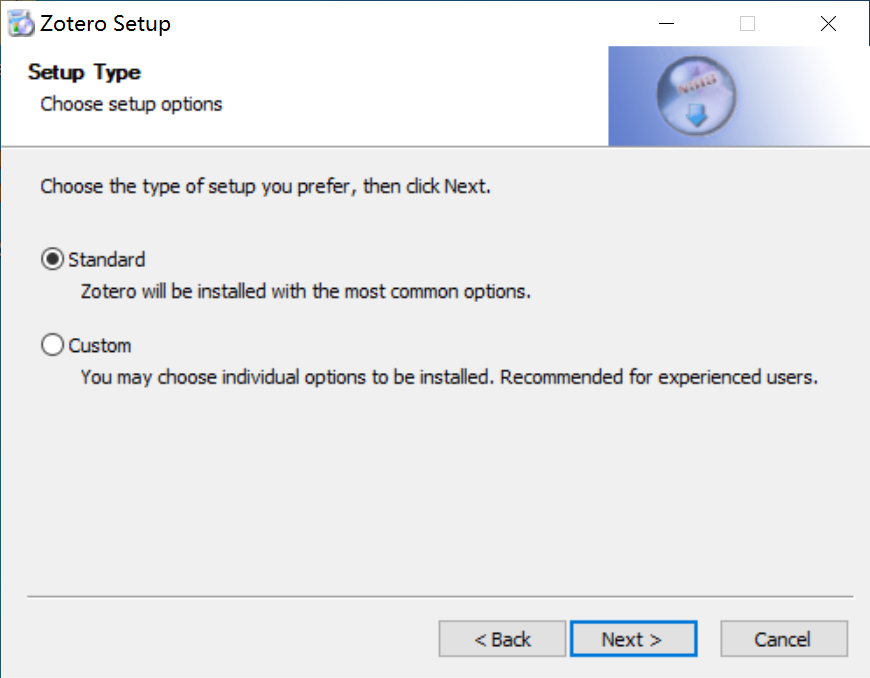
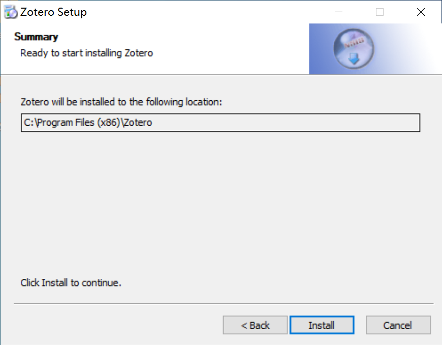
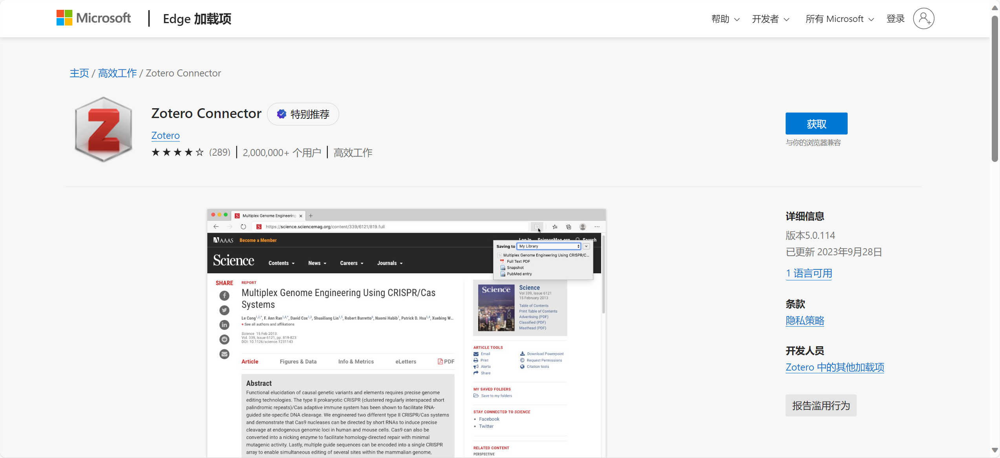
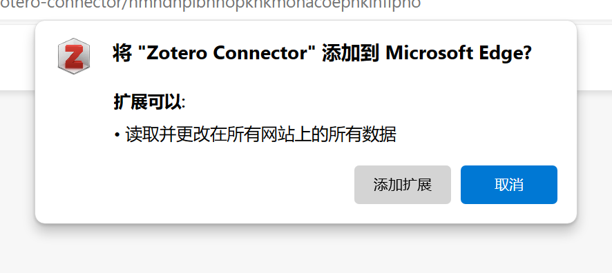
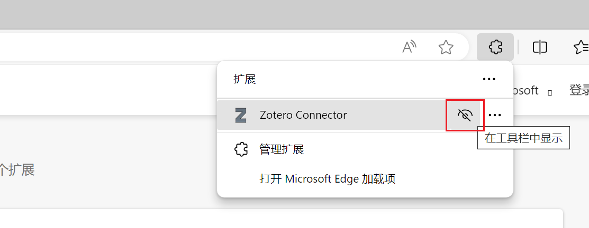

Zotero 安装
===========

Zotero软件的安装
----------------

Zotero的官方网站是\ `http://www.zotero.org/ <http://www.zotero.org/>`_\ 。在主页点击download，跳转到下载页面，选择下载Zotero 6 for windows (macos 则是下载Zotero 6 for macos)。目前软件最新版本是Zotero 6.0.30。

下载之后双击运行安装包。

.. image:: image-4.png
   :target: image-4.png
   :alt: Alt text

点击Next

点击Install

点击Finish后，自动打开了Zotero软件。

.. image:: image-7.png
   :target: image-7.png
   :alt: Alt text

Zotero浏览器插件的安装
----------------------

为了方便文献的导入，需要安装Zotero浏览器插件。

以Microsoft Edge为例：

首先访问 `https://www.zotero.org/download/ <https://www.zotero.org/download/>`_

点击Install Edge Conector，跳转至Edge插件商店

点击获取，添加插件，等待几秒插件安装完成。

点击扩展按钮，取消隐藏Zotero Connector使其在工具栏上显示。

